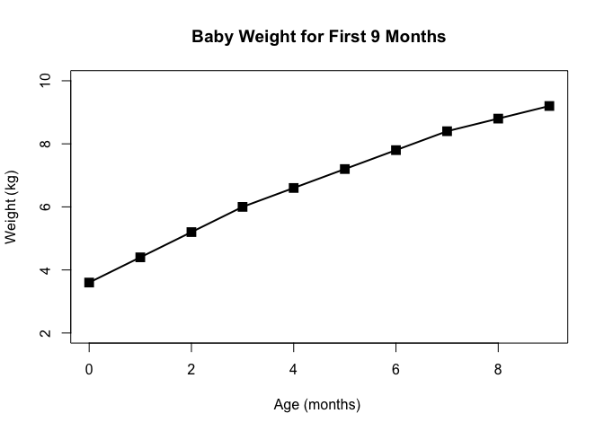
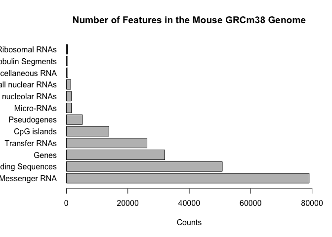
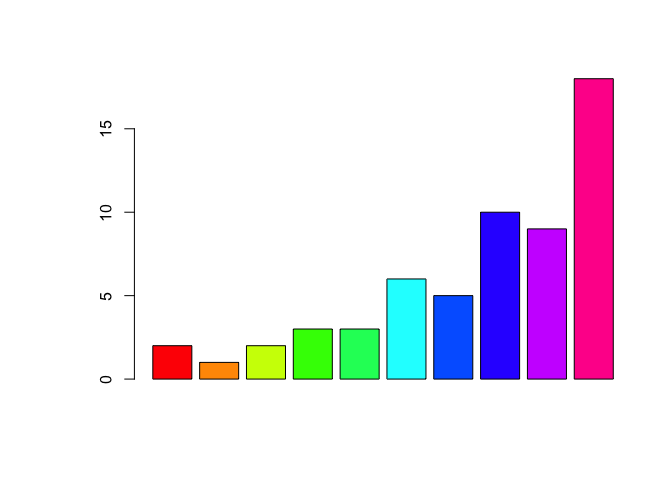
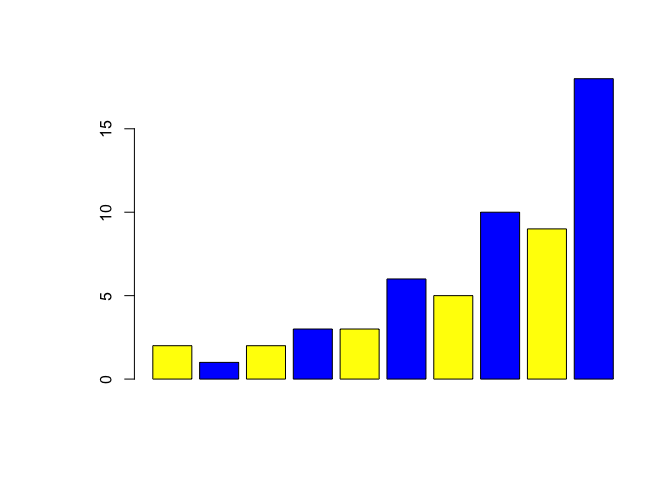
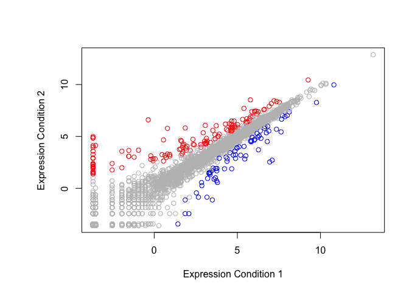
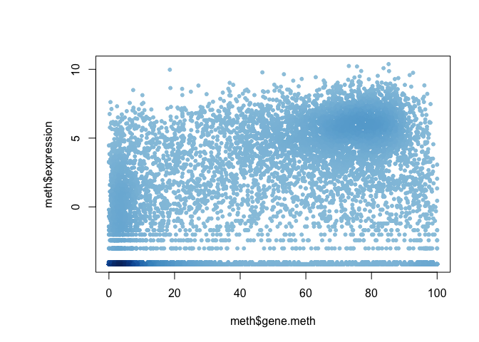
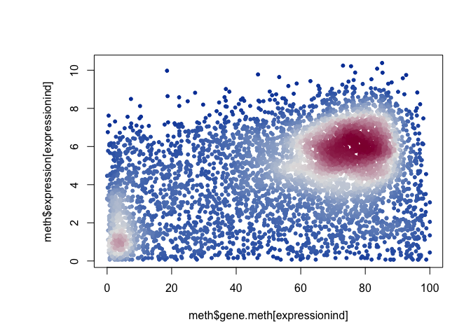

CLass 5 Graphing and Plotting in R
================
Luke Wang
Fri Jan 25 13:32:34 2019

Class 05 Graphics and plots with R

``` r
# Section 2A Line Plot

# Read table with header
weight <- read.table("lecture-5-bggn213-rstats/weight_chart.txt", header = TRUE)

## Line plot weight table
# type = change the type of plots plotted
# pch = change shape of points (integer value), you can use 1:15 to cycle through different 
# col = color of the point, pass it through vector to alternate color  c("",""...)
# cex = how much text and symbols should be magnified
# lwd = line width
# ylim = limits for hte y axis, use vector to bound it
# xlab/ylab = name of x/y lable, in ""

plot( weight,pch=15,type ="o", cex= 1.5, lwd=2, ylim=c(2,10), xlab="Age (months) ", ylab="Weight (kg)", main = "Baby Weight for First 9 Months")
```



``` r
## Barplot of genomic features

# Read features data
# sep = \t (tab)
features <- read.table("lecture-5-bggn213-rstats/feature_counts.txt", header= TRUE, sep = "\t")

# Barplot
# must be vector, so specify the column with numerical values
# horiz = TRUE will set the bar plot to horizontal
# names.org = will set names of the y axis
# las, a setting in par, 1= alway horizonal, 3= always vertical
# par(mar=c()) = c(bottom, left, top, right), should be set prior to the graphic being drawn
# to resotre par, one would set the original par value to a vector then restor par value with the old par vector
# par()$mar will display the default margin
par(mar=c(5.1, 7, 4.1, 2.1))
barplot(features$Count, horiz = TRUE, xlab = "Counts", names.arg = features$Feature, las = 1, main ="Number of Features in the Mouse GRCm38 Genome", xlim = c(0,80000))
```



``` r
## Using colors in plots
# rainbow()
# heat.colors()
# cm.colors()
# topo.colors
# terrain.colors
sex_counts <- read.table("lecture-5-bggn213-rstats/male_female_counts.txt", header = TRUE, sep = "\t")

# color with rainbow()
barplot(sex_counts$Count, col = rainbow(nrow(sex_counts)))
```



``` r
# color with alternating color
barplot(sex_counts$Count, col = c("yellow","blue"))
```



``` r
## Coloring by value
genes <- read.table("lecture-5-bggn213-rstats/up_down_expression.txt", header = TRUE)

state <- genes$State 

# Plot condition 1 vs. condition 2 on dot plot
# Set 3 colors using palette() to assign colors 

palette(c("blue","grey", "red"))
plot(genes$Condition1,genes$Condition2, col= state, ylab = "Expression Condition 2", xlab="Expression Condition 1")
```



``` r
## Dynamic use of color, coloring by Point Density

meth <- read.delim("lecture-5-bggn213-rstats/expression_methylation.txt")

# densCols creates a vector of color values assigned to each point
densColors <- densCols(meth$gene.meth, meth$expression)
plot(meth$gene.meth,meth$expression, col= densColors, pch=20)
```



``` r
# Plot genes with greater than zero expression
# Using colorspaces to assign diverging HCL palette with n=3 to the plot
# Load library(colorspace)
library(colorspace)
expressionind <- meth$expression > 0
densColors <- densCols(meth$gene.meth[expressionind], meth$expression[expressionind], colramp = colorRampPalette(diverge_hcl(3)))
plot(meth$gene.meth[expressionind],meth$expression[expressionind], col= densColors, pch=20)
```


