Class 8 Unsupervised Machine Learning
================
Luke Wang
2/6/2019

Unsupervised Learning in R
==========================

K-means in R
------------

**kmeans()**

``` r
# K-means algorithm with 3 centers, run 20 times,

# kmeans(x, centers = 3, nstart = 20)
```

Generating K means clustering

Generating some data first

``` r
# Generatng some data for clustering analysis

tmp <- c(rnorm(30,-3), rnorm(30,3))
x <- cbind(x=tmp, y=rev(tmp))

plot(x)
```

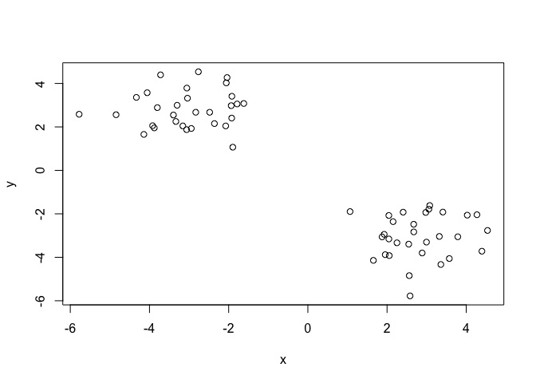

Generating k means clustering

``` r
km1 <- kmeans(x, centers = 2, nstart=20)
km1
```

    ## K-means clustering with 2 clusters of sizes 30, 30
    ## 
    ## Cluster means:
    ##           x         y
    ## 1 -3.048376  2.804828
    ## 2  2.804828 -3.048376
    ## 
    ## Clustering vector:
    ##  [1] 1 1 1 1 1 1 1 1 1 1 1 1 1 1 1 1 1 1 1 1 1 1 1 1 1 1 1 1 1 1 2 2 2 2 2
    ## [36] 2 2 2 2 2 2 2 2 2 2 2 2 2 2 2 2 2 2 2 2 2 2 2 2 2
    ## 
    ## Within cluster sum of squares by cluster:
    ## [1] 51.28938 51.28938
    ##  (between_SS / total_SS =  90.9 %)
    ## 
    ## Available components:
    ## 
    ## [1] "cluster"      "centers"      "totss"        "withinss"    
    ## [5] "tot.withinss" "betweenss"    "size"         "iter"        
    ## [9] "ifault"

Clustering vector shows which cluster each elements belongs do

Create a plot of x colored by cluster

Within SS is shown here with km1$centers, showing the center point of each cluster.

``` r
plot(x, col = km1$cluster)
points(km1$centers, col = "blue", pch=12)
```

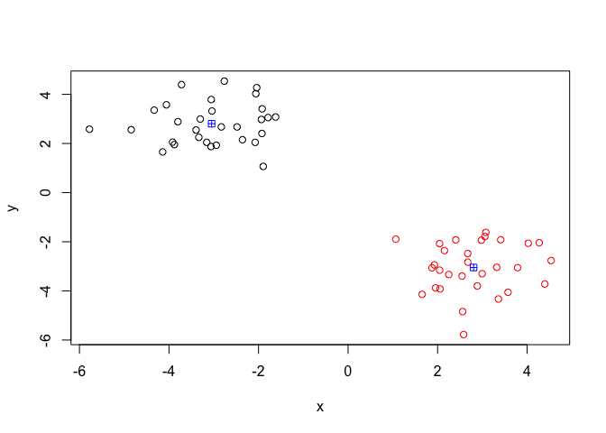

Hierarchical Clustering
-----------------------

### Bototom Up

Each point is first assigned a cluster, then joining each point to form clusters

First, you need to generate a distance matrix of each point using the **dist()**. You can use different method of measuring distacne but the default for hte function is euclidean

``` r
dist_matrix <- dist(x)
```

Then you can pass the distance matrix to the **hclust()**

``` r
hc <-  hclust(d = dist_matrix)
hc
```

    ## 
    ## Call:
    ## hclust(d = dist_matrix)
    ## 
    ## Cluster method   : complete 
    ## Distance         : euclidean 
    ## Number of objects: 60

The print out wont be very useful.

Ploting the hierarchical clustering, it will plot out a dendrogram. It shows 2 "main" clustering because of the big height jump in the end.

H-Clustering can **reveal structure** about the data that is invisble in the means clustering

``` r
plot(hc)
# Drawing a line at height of 6
abline(h=6, col="red")
```

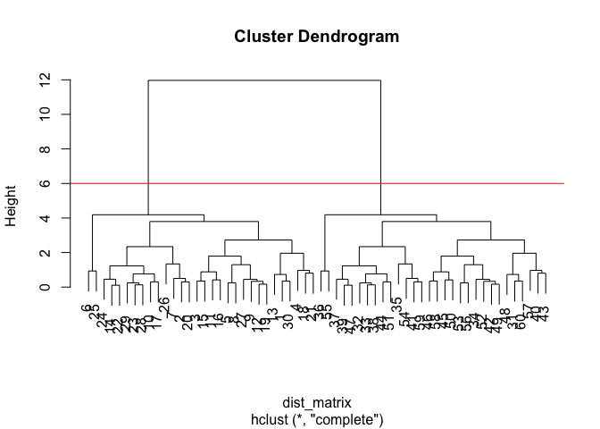

``` r
# Cutting the "tree" at height of 6
grp2 <- cutree(hc, h=6)
```

Plotting the cut tree

``` r
plot(x, col=grp2)
```


Changing where to cut the tree

``` r
plot(hc)
abline(h=2.5, col="blue")
```

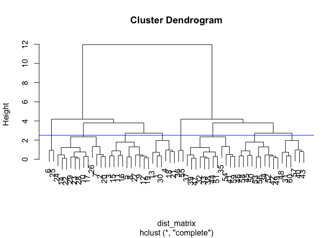

``` r
grp6 <- cutree(hc, h=2.5)
table(grp6)
```

    ## grp6
    ##  1  2  3  4  5  6  7  8 
    ##  6 12 10  2  6 12 10  2

``` r
plot(x, col=grp6)
```

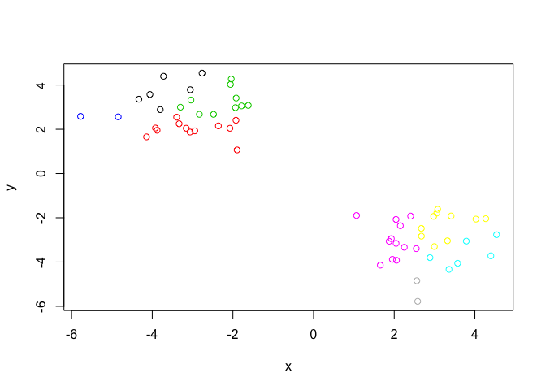

You can tell the **cutree()** to cut into how many groups

``` r
grp3 <- cutree(hc, k=3)
table(grp3)
```

    ## grp3
    ##  1  2  3 
    ## 30 28  2

``` r
plot(x, col=grp3)
```

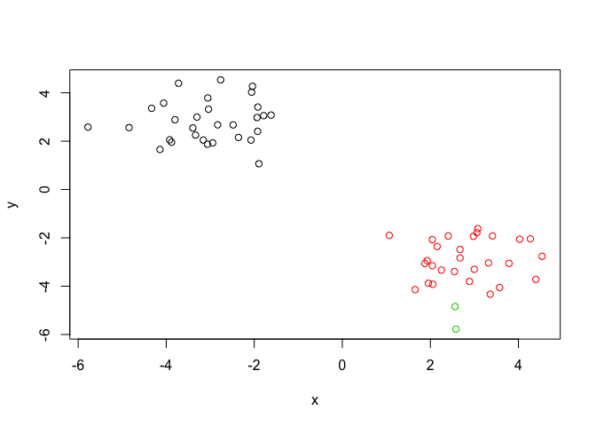

Trying different hierachical clustering methods

``` r
# Complete
hc.complete <- hclust(dist_matrix, method ="complete")
plot(hc.complete)
```

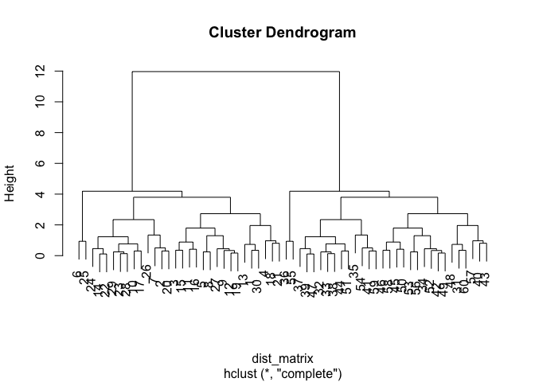

``` r
# Average
hc.average <- hclust(dist_matrix, method = "average")
plot(hc.average)
```

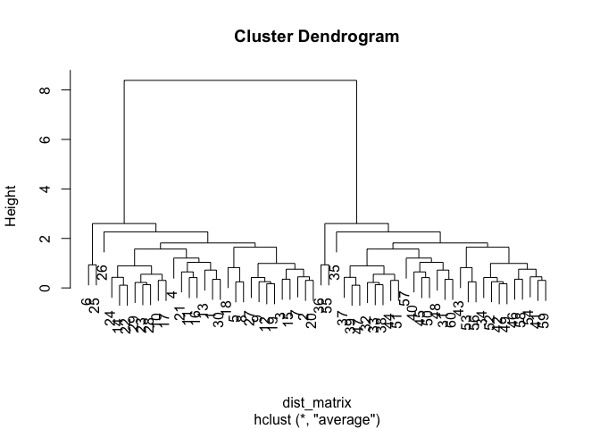

``` r
# Single
hc.single <- hclust(dist_matrix, method = "single")
plot(hc.single)
```

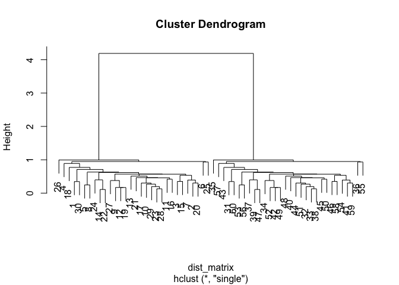

Generating more sample data for clustering

``` r
x1 <- rbind(
  matrix(rnorm(100, mean=0, sd = 0.3), ncol = 2),   # c1
  matrix(rnorm(100, mean = 1, sd = 0.3), ncol = 2), # c2
  matrix(c(rnorm(50, mean = 1, sd = 0.3),           # c3
           rnorm(50, mean = 0, sd = 0.3)), ncol = 2))
colnames(x) <- c("x", "y")
```

Ploting the data x1 without clustering

``` r
plot(x1)
```

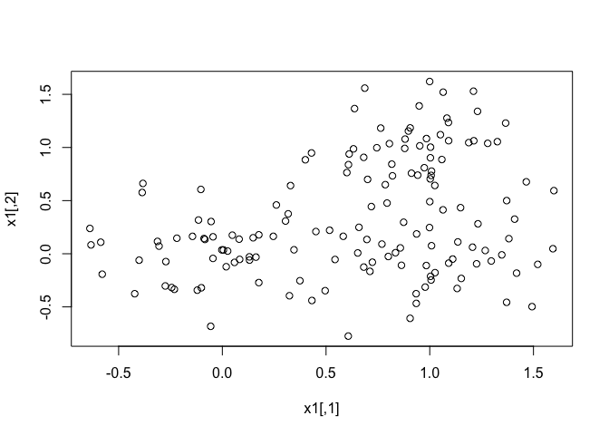

Generate colors for known clusters

``` r
col <- as.factor( rep(c("c1","c2","c3"), each=50) )
plot(x1, col=col)
```

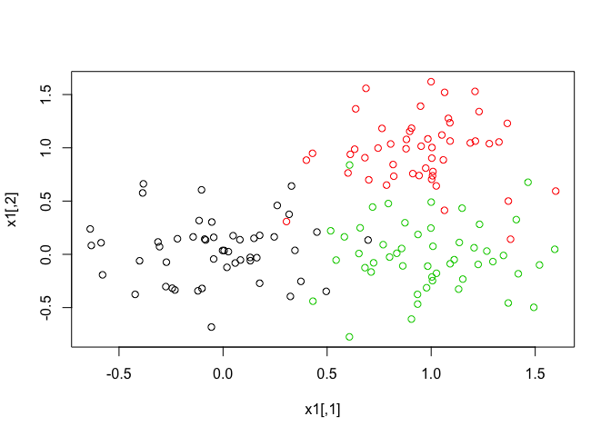

Generating hierachical clustering of x1

``` r
d1 <- dist(x1)
hc1 <- hclust(d=d1)
plot(hc1)
```

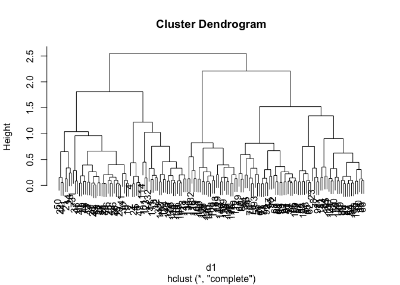

Cutting Tree down to 2 groups

``` r
d1.grp2 <- cutree(hc1, k=2)
d1.grp3 <- cutree(hc1, k=3)
table(d1.grp2)
```

    ## d1.grp2
    ##  1  2 
    ## 63 87

``` r
table(d1.grp3)
```

    ## d1.grp3
    ##  1  2  3 
    ## 63 62 25

Ploting the points with coloring by *hierachical clustering*

``` r
plot(x1, col=d1.grp2)
```

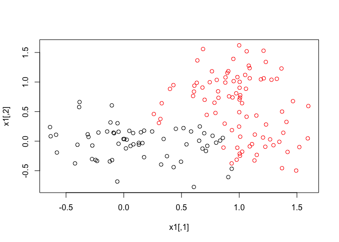

``` r
plot(x1, col=d1.grp3)
```

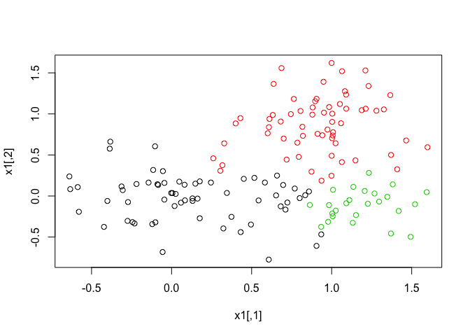

Let's try with *k-means clustering*

``` r
km2.grp2 <- kmeans(x1, centers=2, nstart=20) # with 2 centers
km2.grp3 <- kmeans(x1, centers=3, nstart=20) # with 3 centers
plot(x1, col=km2.grp2$cluster)
```


``` r
plot(x1, col=km2.grp3$cluster)
```

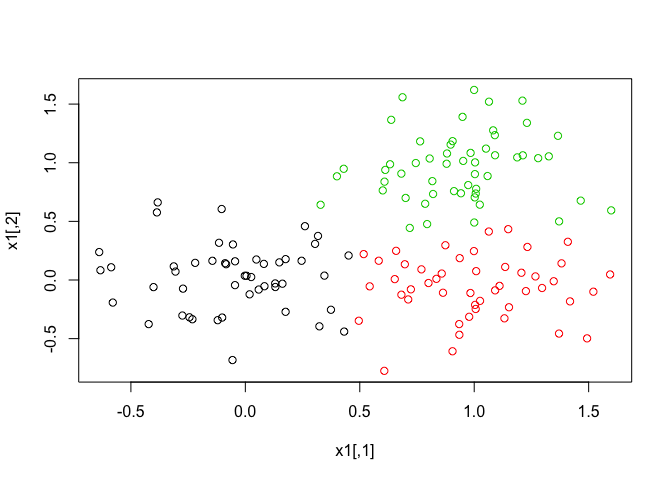

Principal Component Analysis
----------------------------

PCA is a dimensional reduction technique that will summarize the relationship between all components into a representation that we can more easily interpret

If points are clustered together on the "PC" plot, then they are similar to each other

PCs are ranked by their importance, PC1 is more important than PC2 which is more important than PC3. If clusters are separated on PC1 and PC2 then they more similar than clusters separated than PC1 and PC3

PCs are ranked by the amount of variance in the original data that they capture.

PC Loadings will tell us how the original data contributed to each PC

Let's try with some expression data!

``` r
mydata <- read.csv("https://tinyurl.com/expression-CSV",
row.names=1)

head(mydata)
```

    ##        wt1 wt2  wt3  wt4 wt5 ko1 ko2 ko3 ko4 ko5
    ## gene1  439 458  408  429 420  90  88  86  90  93
    ## gene2  219 200  204  210 187 427 423 434 433 426
    ## gene3 1006 989 1030 1017 973 252 237 238 226 210
    ## gene4  783 792  829  856 760 849 856 835 885 894
    ## gene5  181 249  204  244 225 277 305 272 270 279
    ## gene6  460 502  491  491 493 612 594 577 618 638

``` r
# The samples are in columns while the genes are in rows
```

Performing PCA with **prcomp()**

NOTE: prcomp() expects the samples to be rows and genes to be columns so we need to first transpose the matrix with the t() function!

``` r
t.mydata <- t(mydata)
pca <- prcomp(t.mydata, scale = TRUE)
summary(pca)
```

    ## Importance of components:
    ##                           PC1    PC2     PC3     PC4     PC5     PC6
    ## Standard deviation     9.6237 1.5198 1.05787 1.05203 0.88062 0.82545
    ## Proportion of Variance 0.9262 0.0231 0.01119 0.01107 0.00775 0.00681
    ## Cumulative Proportion  0.9262 0.9493 0.96045 0.97152 0.97928 0.98609
    ##                            PC7     PC8     PC9      PC10
    ## Standard deviation     0.80111 0.62065 0.60342 3.348e-15
    ## Proportion of Variance 0.00642 0.00385 0.00364 0.000e+00
    ## Cumulative Proportion  0.99251 0.99636 1.00000 1.000e+00

Proporition of variance is the percent of variance that the PC captures of the original data

Cumulatibve proportion if the sum of all previous PC variance

x is the object that we want to make the PCA plot

``` r
plot(pca$x[,1],pca$x[,2], xlab="PC1", ylab="PC2") # Plot of PCA1 and PCA2
```


Calculating the propotion of variance and plotting the scree plot

``` r
pca.var <- pca$sdev^2
pca.var.per <- round(pca.var/sum(pca.var)*100,1) # Taking the vairance, dividing by the sum of vairance, multiply by a 100 to get percent. Round it to 1 decimal

barplot(pca.var.per, main="Scree Plot", xlab="Principal Componet", ylab = "Percent Variation")
```

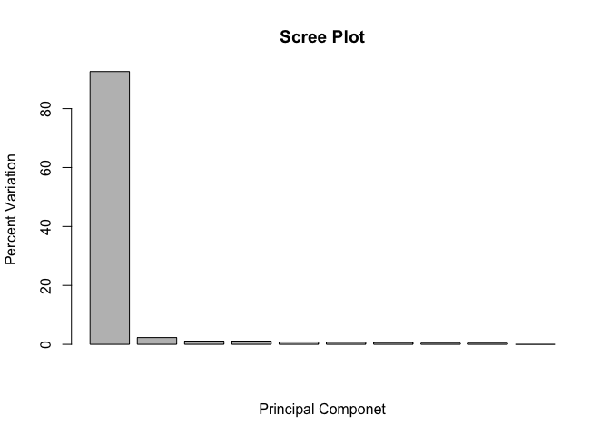

Making our PCA plot more colorful

``` r
colvec <- as.factor (substr(colnames(mydata),1,2)) # getting the column names, then extracting the first 2 character of the name, then turn it into a factor

plot(pca$x[,1], pca$x[,2], col=colvec, pch=16,
xlab=paste0("PC1 (", pca.var.per[1], "%)"),
ylab=paste0("PC2 (", pca.var.per[2], "%)"))
```

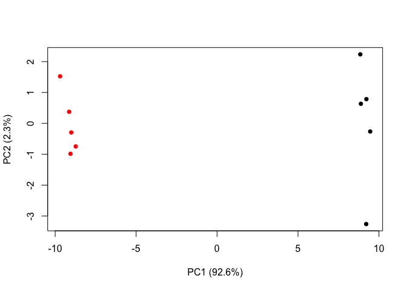

Handson with PCA!
-----------------

Reading the UK Food data

``` r
ukfood <- read.csv("https://bioboot.github.io/bggn213_f17/class-material/UK_foods.csv")
dim(ukfood) # getting the dimension of the data
```

    ## [1] 17  5

Cleaning up the data

``` r
# Removing the "x" column from the data
rownames(ukfood) <- ukfood[,1]
ukfood <- ukfood[,-1]
head(ukfood)
```

    ##                England Wales Scotland N.Ireland
    ## Cheese             105   103      103        66
    ## Carcass_meat       245   227      242       267
    ## Other_meat         685   803      750       586
    ## Fish               147   160      122        93
    ## Fats_and_oils      193   235      184       209
    ## Sugars             156   175      147       139

``` r
dim(ukfood)
```

    ## [1] 17  4

We could have alternatively set the row name correctly by adding the argument row.names=1 when reading the csv file. Be aware the the index minus trick of setting the row names if ran multiple times will mess up the names. It will keep minusing 1 each time it is run.

``` r
ukfood <- read.csv("https://bioboot.github.io/bggn213_f17/class-material/UK_foods.csv", row.names = 1)
```

Visually inspecting the data for differences and trends

``` r
# Traditional bar plot
barplot(as.matrix(ukfood), beside=T, col=rainbow(nrow(ukfood)))
```


``` r
# Changing the beside to false will make a stacked plot 
barplot(as.matrix(ukfood), beside=F, col=rainbow(nrow(ukfood)))
```


Here we will generate all pairwise plots

``` r
pairs(ukfood, col=rainbow(10),pch=16)
```


Using PCA to analyze this multidimensional data

``` r
pca.uk <- prcomp(t(ukfood))
summary(pca.uk)
```

    ## Importance of components:
    ##                             PC1      PC2      PC3       PC4
    ## Standard deviation     324.1502 212.7478 73.87622 4.189e-14
    ## Proportion of Variance   0.6744   0.2905  0.03503 0.000e+00
    ## Cumulative Proportion    0.6744   0.9650  1.00000 1.000e+00

Plotting the PC1 vs PC2

``` r
ukcol <- c("gold","red", "blue", "green")
plot (pca.uk$x[,1], pca.uk$x[,2], xlab="PC1", ylab="PC2", xlim=c(-270, 500))
text(pca.uk$x[,1], pca.uk$x[,2], colnames(ukfood), col=ukcol)
```

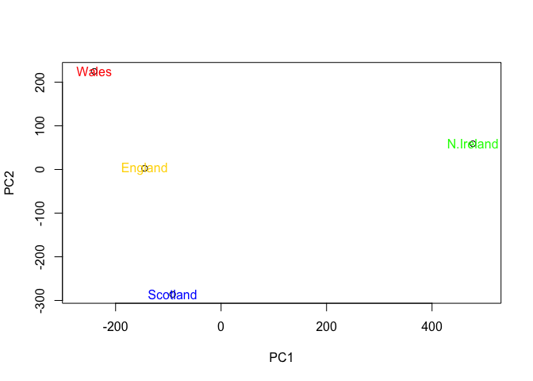

Drawing the scree plot

``` r
ukvar <- round(pca.uk$sdev^2/sum(pca.uk$sdev^2)*100,1)
ukvar
```

    ## [1] 67.4 29.1  3.5  0.0

``` r
barplot(ukvar, xlab="Principal Component", ylab="Percent Variation")
```

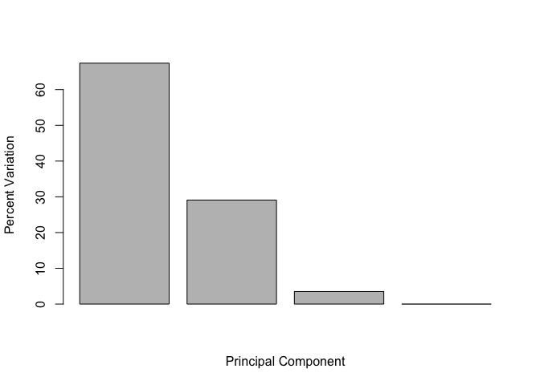

Examinign the variable loadings of PC1

``` r
par(mar=c(10,3,0.35,0)) # Setting the margin to allow text to show
barplot (pca.uk$rotation[,1],las=2)
```


Examinign the variable loadings of PC2

``` r
par(mar=c(10,3,0.35,0))
barplot (pca.uk$rotation[,2],las=2)
```


We can also exapin the variable loading with a biplot

``` r
biplot(pca.uk)
```


