Class 09 Unsupervised Learning Analysis of Human Breast Cancer Cells
================
Luke Wang
2/8/2019

Analyzing Human Breast Cancer Cells!
====================================

Reading and Examining the Data
------------------------------

Importing the csv file

``` r
wisc.df <- read.csv("~/Desktop/BGGN 213/class09/WisconsinCancer.csv")

# Examing the Data

head(wisc.df)
```

    ##         id diagnosis radius_mean texture_mean perimeter_mean area_mean
    ## 1   842302         M       17.99        10.38         122.80    1001.0
    ## 2   842517         M       20.57        17.77         132.90    1326.0
    ## 3 84300903         M       19.69        21.25         130.00    1203.0
    ## 4 84348301         M       11.42        20.38          77.58     386.1
    ## 5 84358402         M       20.29        14.34         135.10    1297.0
    ## 6   843786         M       12.45        15.70          82.57     477.1
    ##   smoothness_mean compactness_mean concavity_mean concave.points_mean
    ## 1         0.11840          0.27760         0.3001             0.14710
    ## 2         0.08474          0.07864         0.0869             0.07017
    ## 3         0.10960          0.15990         0.1974             0.12790
    ## 4         0.14250          0.28390         0.2414             0.10520
    ## 5         0.10030          0.13280         0.1980             0.10430
    ## 6         0.12780          0.17000         0.1578             0.08089
    ##   symmetry_mean fractal_dimension_mean radius_se texture_se perimeter_se
    ## 1        0.2419                0.07871    1.0950     0.9053        8.589
    ## 2        0.1812                0.05667    0.5435     0.7339        3.398
    ## 3        0.2069                0.05999    0.7456     0.7869        4.585
    ## 4        0.2597                0.09744    0.4956     1.1560        3.445
    ## 5        0.1809                0.05883    0.7572     0.7813        5.438
    ## 6        0.2087                0.07613    0.3345     0.8902        2.217
    ##   area_se smoothness_se compactness_se concavity_se concave.points_se
    ## 1  153.40      0.006399        0.04904      0.05373           0.01587
    ## 2   74.08      0.005225        0.01308      0.01860           0.01340
    ## 3   94.03      0.006150        0.04006      0.03832           0.02058
    ## 4   27.23      0.009110        0.07458      0.05661           0.01867
    ## 5   94.44      0.011490        0.02461      0.05688           0.01885
    ## 6   27.19      0.007510        0.03345      0.03672           0.01137
    ##   symmetry_se fractal_dimension_se radius_worst texture_worst
    ## 1     0.03003             0.006193        25.38         17.33
    ## 2     0.01389             0.003532        24.99         23.41
    ## 3     0.02250             0.004571        23.57         25.53
    ## 4     0.05963             0.009208        14.91         26.50
    ## 5     0.01756             0.005115        22.54         16.67
    ## 6     0.02165             0.005082        15.47         23.75
    ##   perimeter_worst area_worst smoothness_worst compactness_worst
    ## 1          184.60     2019.0           0.1622            0.6656
    ## 2          158.80     1956.0           0.1238            0.1866
    ## 3          152.50     1709.0           0.1444            0.4245
    ## 4           98.87      567.7           0.2098            0.8663
    ## 5          152.20     1575.0           0.1374            0.2050
    ## 6          103.40      741.6           0.1791            0.5249
    ##   concavity_worst concave.points_worst symmetry_worst
    ## 1          0.7119               0.2654         0.4601
    ## 2          0.2416               0.1860         0.2750
    ## 3          0.4504               0.2430         0.3613
    ## 4          0.6869               0.2575         0.6638
    ## 5          0.4000               0.1625         0.2364
    ## 6          0.5355               0.1741         0.3985
    ##   fractal_dimension_worst  X
    ## 1                 0.11890 NA
    ## 2                 0.08902 NA
    ## 3                 0.08758 NA
    ## 4                 0.17300 NA
    ## 5                 0.07678 NA
    ## 6                 0.12440 NA

Converting column 3-32 as a matrix as we need to modify the patient ID and diagnosis.

``` r
wisc.data <- as.matrix(wisc.df[,3:32])
```

Now we are going to add the patient ID to the row names

``` r
row.names(wisc.data) <- wisc.df$id
```

We are also going to re-code the diganosis code to 1 (Benign) and 2 (Malignant)

``` r
wisc.diagnosis <- as.numeric(wisc.df$diagnosis=="B")
table(wisc.diagnosis)
```

    ## wisc.diagnosis
    ##   0   1 
    ## 212 357

Examining the column names. We want to know how many features of the columns has \_mean

``` r
wisc.colname <- colnames(wisc.data)
wisc.colname
```

    ##  [1] "radius_mean"             "texture_mean"           
    ##  [3] "perimeter_mean"          "area_mean"              
    ##  [5] "smoothness_mean"         "compactness_mean"       
    ##  [7] "concavity_mean"          "concave.points_mean"    
    ##  [9] "symmetry_mean"           "fractal_dimension_mean" 
    ## [11] "radius_se"               "texture_se"             
    ## [13] "perimeter_se"            "area_se"                
    ## [15] "smoothness_se"           "compactness_se"         
    ## [17] "concavity_se"            "concave.points_se"      
    ## [19] "symmetry_se"             "fractal_dimension_se"   
    ## [21] "radius_worst"            "texture_worst"          
    ## [23] "perimeter_worst"         "area_worst"             
    ## [25] "smoothness_worst"        "compactness_worst"      
    ## [27] "concavity_worst"         "concave.points_worst"   
    ## [29] "symmetry_worst"          "fractal_dimension_worst"

``` r
# Use to pattern match "_mean"
ind.mean <- grep("_mean",wisc.colname)

# We will now get the column names with the mean

colnames(wisc.data)[ind.mean]
```

    ##  [1] "radius_mean"            "texture_mean"          
    ##  [3] "perimeter_mean"         "area_mean"             
    ##  [5] "smoothness_mean"        "compactness_mean"      
    ##  [7] "concavity_mean"         "concave.points_mean"   
    ##  [9] "symmetry_mean"          "fractal_dimension_mean"

Performing the Principal Component Analysis
-------------------------------------------

In order to proceed with PCA we need to check if the data need to be scaled when the analysis is done. To check we will perform a column mean and standard deviation analysis.

``` r
# We are calculating the column means and rounding it to 2 decimal place
round(colMeans(wisc.data),2)
```

    ##             radius_mean            texture_mean          perimeter_mean 
    ##                   14.13                   19.29                   91.97 
    ##               area_mean         smoothness_mean        compactness_mean 
    ##                  654.89                    0.10                    0.10 
    ##          concavity_mean     concave.points_mean           symmetry_mean 
    ##                    0.09                    0.05                    0.18 
    ##  fractal_dimension_mean               radius_se              texture_se 
    ##                    0.06                    0.41                    1.22 
    ##            perimeter_se                 area_se           smoothness_se 
    ##                    2.87                   40.34                    0.01 
    ##          compactness_se            concavity_se       concave.points_se 
    ##                    0.03                    0.03                    0.01 
    ##             symmetry_se    fractal_dimension_se            radius_worst 
    ##                    0.02                    0.00                   16.27 
    ##           texture_worst         perimeter_worst              area_worst 
    ##                   25.68                  107.26                  880.58 
    ##        smoothness_worst       compactness_worst         concavity_worst 
    ##                    0.13                    0.25                    0.27 
    ##    concave.points_worst          symmetry_worst fractal_dimension_worst 
    ##                    0.11                    0.29                    0.08

``` r
# Calculating the standard deviation with the apply command to perform calculation over all the columns.

round(apply(wisc.data, 2, sd),2)
```

    ##             radius_mean            texture_mean          perimeter_mean 
    ##                    3.52                    4.30                   24.30 
    ##               area_mean         smoothness_mean        compactness_mean 
    ##                  351.91                    0.01                    0.05 
    ##          concavity_mean     concave.points_mean           symmetry_mean 
    ##                    0.08                    0.04                    0.03 
    ##  fractal_dimension_mean               radius_se              texture_se 
    ##                    0.01                    0.28                    0.55 
    ##            perimeter_se                 area_se           smoothness_se 
    ##                    2.02                   45.49                    0.00 
    ##          compactness_se            concavity_se       concave.points_se 
    ##                    0.02                    0.03                    0.01 
    ##             symmetry_se    fractal_dimension_se            radius_worst 
    ##                    0.01                    0.00                    4.83 
    ##           texture_worst         perimeter_worst              area_worst 
    ##                    6.15                   33.60                  569.36 
    ##        smoothness_worst       compactness_worst         concavity_worst 
    ##                    0.02                    0.16                    0.21 
    ##    concave.points_worst          symmetry_worst fractal_dimension_worst 
    ##                    0.07                    0.06                    0.02

``` r
# We will perform the PCA with scaling because mean and standard deviation are quite variable between columns
```

Performing the PCA!

``` r
wisc.pr <- prcomp(wisc.data, scale = TRUE)

summary(wisc.pr)
```

    ## Importance of components:
    ##                           PC1    PC2     PC3     PC4     PC5     PC6
    ## Standard deviation     3.6444 2.3857 1.67867 1.40735 1.28403 1.09880
    ## Proportion of Variance 0.4427 0.1897 0.09393 0.06602 0.05496 0.04025
    ## Cumulative Proportion  0.4427 0.6324 0.72636 0.79239 0.84734 0.88759
    ##                            PC7     PC8    PC9    PC10   PC11    PC12
    ## Standard deviation     0.82172 0.69037 0.6457 0.59219 0.5421 0.51104
    ## Proportion of Variance 0.02251 0.01589 0.0139 0.01169 0.0098 0.00871
    ## Cumulative Proportion  0.91010 0.92598 0.9399 0.95157 0.9614 0.97007
    ##                           PC13    PC14    PC15    PC16    PC17    PC18
    ## Standard deviation     0.49128 0.39624 0.30681 0.28260 0.24372 0.22939
    ## Proportion of Variance 0.00805 0.00523 0.00314 0.00266 0.00198 0.00175
    ## Cumulative Proportion  0.97812 0.98335 0.98649 0.98915 0.99113 0.99288
    ##                           PC19    PC20   PC21    PC22    PC23   PC24
    ## Standard deviation     0.22244 0.17652 0.1731 0.16565 0.15602 0.1344
    ## Proportion of Variance 0.00165 0.00104 0.0010 0.00091 0.00081 0.0006
    ## Cumulative Proportion  0.99453 0.99557 0.9966 0.99749 0.99830 0.9989
    ##                           PC25    PC26    PC27    PC28    PC29    PC30
    ## Standard deviation     0.12442 0.09043 0.08307 0.03987 0.02736 0.01153
    ## Proportion of Variance 0.00052 0.00027 0.00023 0.00005 0.00002 0.00000
    ## Cumulative Proportion  0.99942 0.99969 0.99992 0.99997 1.00000 1.00000

PC1 captured **44.27%** of the variance and we need at least the first **3 PCs** to cpature at least 70% of the original variance. We need at least **7 PCs** to capture at least 90% of the original variance

Interpreting PCA Results
------------------------

We will do some visualization of the PCA results. First we will use biplot

``` r
biplot(wisc.pr)
```

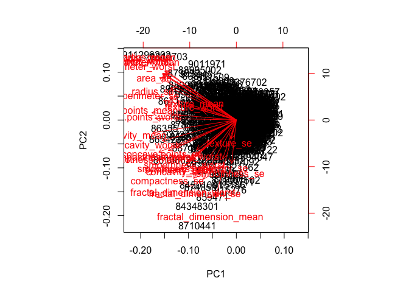

Nothing really stands out from the biplot because of the number of observations. They are all clumped in the center. Biplot might not be very useful in this situation, instead we will create a more standard scatter plot.

``` r
# Creating the scalter plot of PC1 and PC2 and coloring the points based on the diagnosis

plot(wisc.pr$x[,1], wisc.pr$x[,2], col = wisc.diagnosis+1, xlab= "PC1", ylab = "PC2")
```

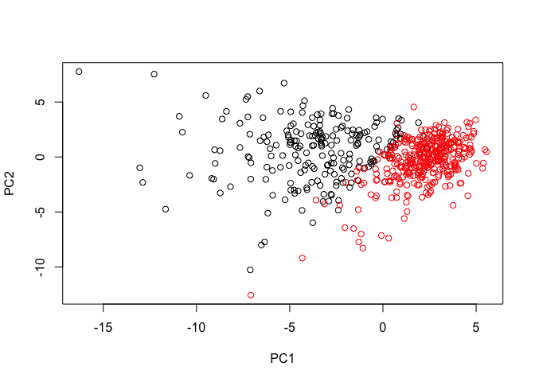

Now we will plot the the PC1 and PC3

``` r
plot(wisc.pr$x[,1], wisc.pr$x[,3], col = wisc.diagnosis+1, xlab= "PC1", ylab = "PC3")
```

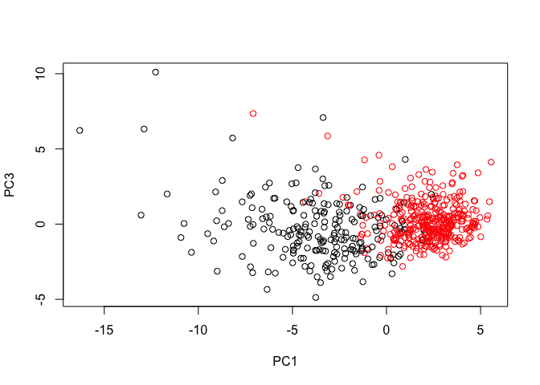

Visualizing Variance
--------------------

We will create a scree plot but first we need to calculate the variance

``` r
wisc.pr.var <- wisc.pr$sdev^2
# head(wisc.pr.var) will examine the variance that we just calculated
```

``` r
wisc.pve <- round(wisc.pr.var/sum(wisc.pr.var), 4)

# Line plot of variance 
plot(wisc.pve, xlab= "Principal Components", ylab= "Proportion of Variance Explained", ylim = c(0,1), type ="o")
```

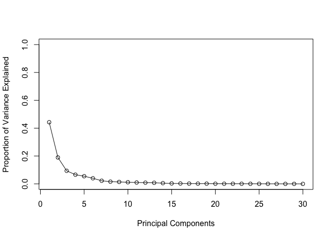

``` r
# Barplot of variance, naming each axis tick with PC number
barplot(wisc.pve, ylab= "Percent of Variance Explained", names.arg = paste0("PC", 1:length(wisc.pve)) , las=2, axes=F)

# This will create a y axis label based on the percent variance 
axis(2, at=wisc.pve, labels = round(wisc.pve,2)*100)
```

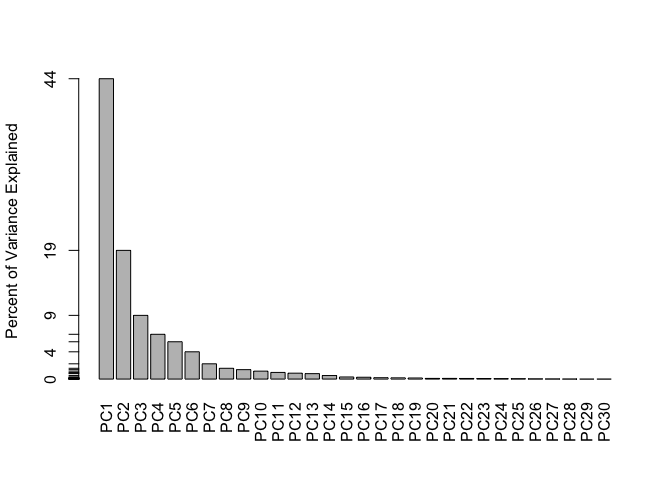

We can also create a cumulative sum plot

``` r
plot(cumsum(wisc.pve), xlab="Principal Component", ylab="Cumulative Proportion of Variance Explained", ylim=c(0,1), type="o")
```

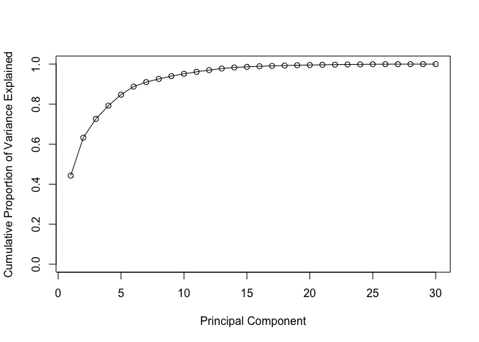

We will now create the regular line plot and cumulative sum plot side by side

``` r
par(mfrow= c(1,2), mar= c(5,4,4,2))

plot(wisc.pve, xlab= "Principal Components", ylab= "Proportion of Variance Explained", ylim = c(0,1), type ="o")

plot(cumsum(wisc.pve), xlab="Principal Component", ylab="Cumulative Proportion of Variance Explained", ylim=c(0,1), type="o")
```

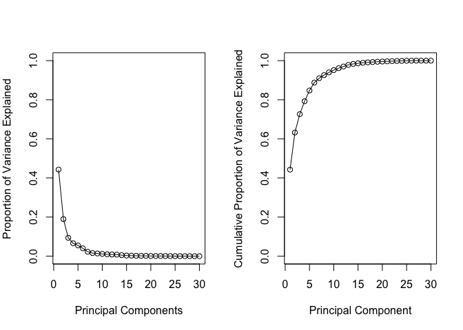

We can also plot some ggplot based graph that are prettier

``` r
# Installing the facoextra package
# install.packages("factoextra")

# Loading the factoextra package for use
library(factoextra)
```

    ## Loading required package: ggplot2

    ## Welcome! Related Books: `Practical Guide To Cluster Analysis in R` at https://goo.gl/13EFCZ

``` r
fviz_eig(wisc.pr, addlabels= T, ncp = length(wisc.pve))
```

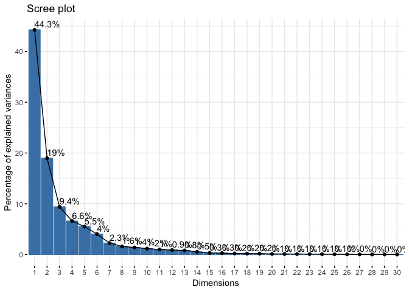

Combining Methods of PCA Clustering
-----------------------------------

We are going to perform hierachical clustering based on the PCA results. We need at least PCs that will describe 90% of the original variance. In this case PC1-7 will do that.

First we will just do the clustering based on the first 2 PCs

``` r
dist_wisc <- dist(wisc.pr$x[,1:2])

wisc.pr.hclust <-hclust(dist_wisc, method = "ward.D2")

plot (wisc.pr.hclust)
```

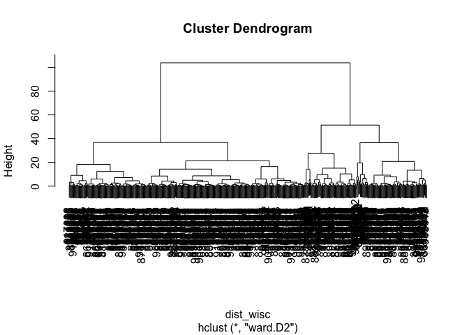

Now that we have the hierachical clustering done, we will now trim the dendrogram to 2 groups.

``` r
wisc.grp2 <- cutree(wisc.pr.hclust, k=2)
table(wisc.grp2)
```

    ## wisc.grp2
    ##   1   2 
    ## 195 374

Now we will compare the original diganosis to the grouping by hierachical clustering

``` r
table(wisc.grp2, wisc.diagnosis+1)
```

    ##          
    ## wisc.grp2   1   2
    ##         1 177  18
    ##         2  35 339

We will now plot the hierachical clustering grouping on to the scatter plot and color it. We will also compare the h-clustering and/or diagnosis

``` r
par(mfrow= c(1,2))
plot(wisc.pr$x[,1:2],col=wisc.grp2, main="H-Clustering")

plot(wisc.pr$x[,1:2], col=wisc.diagnosis+1, main="Diagnosis")
```

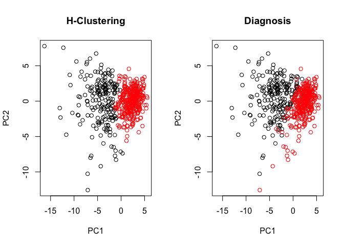

We can also plot the PC plot in 3D with rgl

``` r
# install.packages("rgl")

# library("rgl")

# We need to install Xquartz to do this...we will do this later
```

Now we will do the clusterin based on the first 7 PCs instead of 2.

We will plot the dendrogram based on the clustering of first 7 PCs

``` r
dist_wisc7 <- dist(wisc.pr$x[,1:7])

wisc.pr.hclust7 <-hclust(dist_wisc7, method = "ward.D2")

plot (wisc.pr.hclust7)
```

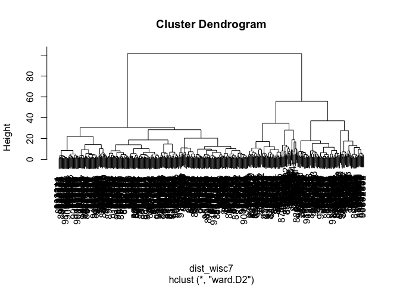

Now we will cut that dendrogram to 2 groups

``` r
wisc7.grp2 <- cutree(wisc.pr.hclust7, k=2)
table(wisc7.grp2)
```

    ## wisc7.grp2
    ##   1   2 
    ## 216 353

Now we will plot the clustering based on 7 Pcs

``` r
par(mfrow= c(1,2))
plot(wisc.pr$x[,1:2],col=wisc7.grp2, main="H-Clustering of 7 PCs")

plot(wisc.pr$x[,1:2], col=wisc.diagnosis+1, main="Diagnosis")
```

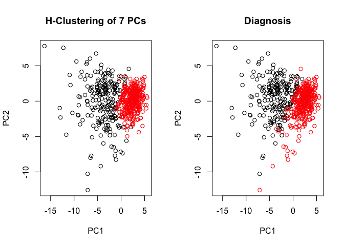

We should compare the sensitivity and specificity of this clustering based on the 7 PCs

``` r
table(wisc7.grp2, wisc.diagnosis+1)
```

    ##           
    ## wisc7.grp2   1   2
    ##          1 188  28
    ##          2  24 329

Prediction
----------

We will use the predict function to use our PCA to analyze new cancer cell data

``` r
new.cancer <- read.csv("https://tinyurl.com/new-samples-CSV")

npc <- predict(wisc.pr, newdata=new.cancer)

npc
```

    ##            PC1       PC2        PC3        PC4       PC5        PC6
    ## [1,]  2.576616 -3.135913  1.3990492 -0.7631950  2.781648 -0.8150185
    ## [2,] -4.754928 -3.009033 -0.1660946 -0.6052952 -1.140698 -1.2189945
    ##             PC7        PC8       PC9       PC10      PC11      PC12
    ## [1,] -0.3959098 -0.2307350 0.1029569 -0.9272861 0.3411457  0.375921
    ## [2,]  0.8193031 -0.3307423 0.5281896 -0.4855301 0.7173233 -1.185917
    ##           PC13     PC14      PC15       PC16        PC17        PC18
    ## [1,] 0.1610764 1.187882 0.3216974 -0.1743616 -0.07875393 -0.11207028
    ## [2,] 0.5893856 0.303029 0.1299153  0.1448061 -0.40509706  0.06565549
    ##             PC19       PC20       PC21       PC22       PC23       PC24
    ## [1,] -0.08802955 -0.2495216  0.1228233 0.09358453 0.08347651  0.1223396
    ## [2,]  0.25591230 -0.4289500 -0.1224776 0.01732146 0.06316631 -0.2338618
    ##             PC25         PC26         PC27        PC28         PC29
    ## [1,]  0.02124121  0.078884581  0.220199544 -0.02946023 -0.015620933
    ## [2,] -0.20755948 -0.009833238 -0.001134152  0.09638361  0.002795349
    ##              PC30
    ## [1,]  0.005269029
    ## [2,] -0.019015820

We will now plot the new cancer cell data on to the original PCA plot.

``` r
plot(wisc.pr$x[,1:2], col=wisc.diagnosis+1)
points(npc[,1],npc[,2], col="blue", pch=15, cex=1.5)
```


