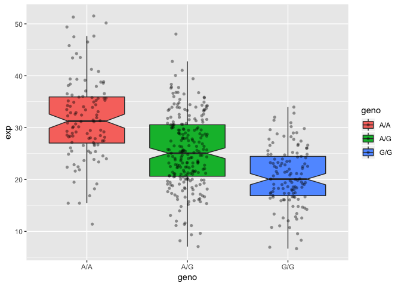

Class 13 Genomic Informatio and High Throughput Sequencing
================
Luke Wang
2/22/2019

Identify genetic variants of interest
-------------------------------------

We have found the 1000 genome project data for the SNP rs8067378 in ENSEMBLE and we are going to analyze the data to see how many of the people with Mexican ancestry in Los Angeles has the specific variant.

``` r
mxl <- read.csv("373531-SampleGenotypes-Homo_sapiens_Variation_Sample_rs8067378.csv")
geno <- table(mxl$Genotype..forward.strand.) # Get the number of variants for each genotype variant from the csv file
round(geno/nrow(mxl)*100,1) # getting the percetnage for each variant
```

    ## 
    ##  A|A  A|G  G|A  G|G 
    ## 34.4 32.8 18.8 14.1

Initial RNA Analysis
--------------------

``` r
library(seqinr)
library(gtools)

chars <- s2c("DDDDCDEDCDDDDBBDDDCC@") # This take a single string and breaks it in to individual characters
chars
```

    ##  [1] "D" "D" "D" "D" "C" "D" "E" "D" "C" "D" "D" "D" "D" "B" "B" "D" "D"
    ## [18] "D" "C" "C" "@"

``` r
phred <- asc(chars)-33 # This converts the ASCII characters from s2c function to numerical value
phred
```

    ##  D  D  D  D  C  D  E  D  C  D  D  D  D  B  B  D  D  D  C  C  @ 
    ## 35 35 35 35 34 35 36 35 34 35 35 35 35 33 33 35 35 35 34 34 31

``` r
prob <- 10**(-phred/10) # This calculates the probability for the base call
prob
```

    ##            D            D            D            D            C 
    ## 0.0003162278 0.0003162278 0.0003162278 0.0003162278 0.0003981072 
    ##            D            E            D            C            D 
    ## 0.0003162278 0.0002511886 0.0003162278 0.0003981072 0.0003162278 
    ##            D            D            D            B            B 
    ## 0.0003162278 0.0003162278 0.0003162278 0.0005011872 0.0005011872 
    ##            D            D            D            C            C 
    ## 0.0003162278 0.0003162278 0.0003162278 0.0003981072 0.0003981072 
    ##            @ 
    ## 0.0007943282

Population Scale Analysis
-------------------------

We will analyze the ~230 patient samples and whether there is any assosication of the 4 asthma-assosicated SNPs on ORMDL3 expression.

``` r
patient <- read.table("rs8067378_ENSG00000172057.6.txt")

table(patient$geno)
```

    ## 
    ## A/A A/G G/G 
    ## 108 233 121

``` r
summary(patient)
```

    ##      sample     geno          exp        
    ##  HG00096:  1   A/A:108   Min.   : 6.675  
    ##  HG00097:  1   A/G:233   1st Qu.:20.004  
    ##  HG00099:  1   G/G:121   Median :25.116  
    ##  HG00100:  1             Mean   :25.640  
    ##  HG00101:  1             3rd Qu.:30.779  
    ##  HG00102:  1             Max.   :51.518  
    ##  (Other):456

``` r
inds.gg <- patient$geno=="G/G"
ggexp <- patient$exp[inds.gg]
summary(ggexp)
```

    ##    Min. 1st Qu.  Median    Mean 3rd Qu.    Max. 
    ##   6.675  16.903  20.074  20.594  24.457  33.956

``` r
inds.aa <- patient$geno=="A/A"
aaexp <- patient$exp[inds.aa]
summary(aaexp)
```

    ##    Min. 1st Qu.  Median    Mean 3rd Qu.    Max. 
    ##   11.40   27.02   31.25   31.82   35.92   51.52

``` r
inds.ag <- patient$geno=="A/G"
agexp <- patient$exp[inds.ag]
summary(agexp)
```

    ##    Min. 1st Qu.  Median    Mean 3rd Qu.    Max. 
    ##   7.075  20.626  25.065  25.397  30.552  48.034

Now we will create a boxplot based on the genotype column using the formula argument in boxplot()

``` r
boxplot(exp ~geno, data = patient, notch = T)
```


Creating a fancier plot in ggplot2

``` r
library(ggplot2)
# Boxplot with the data shown
ggplot(patient, aes(geno, exp, fill=geno)) + 
  geom_boxplot(notch=TRUE, outlier.shape = NA) + 
  geom_jitter(shape=16, position=position_jitter(0.2), alpha=0.4)
```


