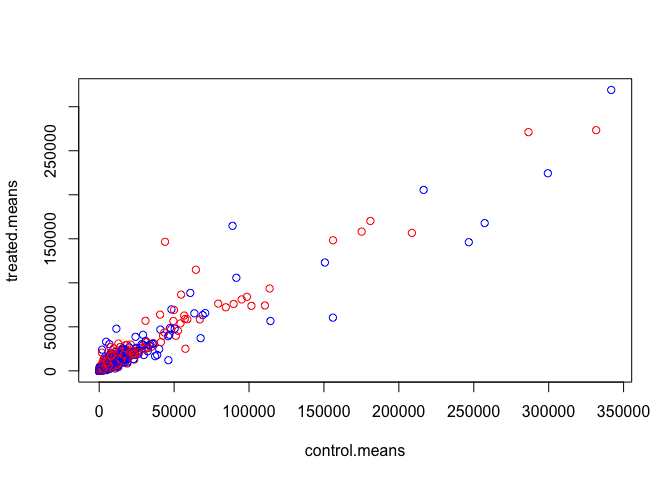
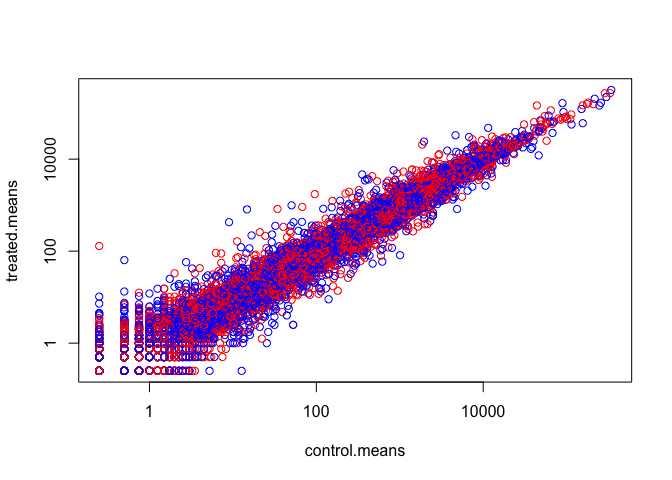
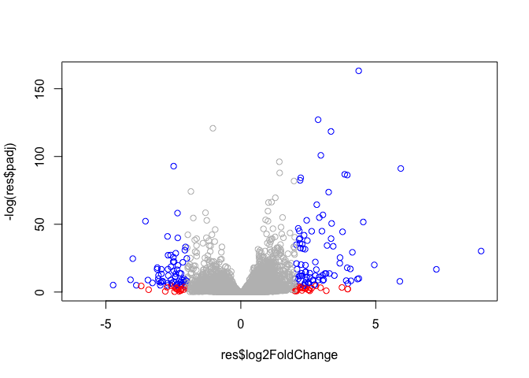
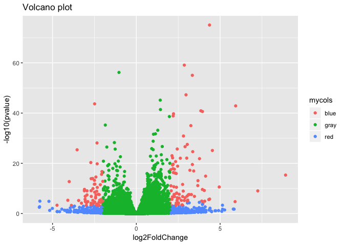

Class 14 Transcriptomics and the analysis of RNA-Seq data
================
Luke Wang
2/27/2019

RNA-Seq Analysis
================

Import countData and colData
----------------------------

countData contains the information for each gene while colData contain metadata for metadata information.

``` r
counts <- read.csv("data/airway_scaledcounts.csv", stringsAsFactors = FALSE)
# stringsAsFactors = FALSE prevents the gene names from being convoerted to factors
metadata <- read.csv("data/airway_metadata.csv", stringsAsFactors = FALSE)
```

Now let's examine the data structure of these files. It's very important the column of ID in colData must match the countData row names.

``` r
head(counts)
```

    ##           ensgene SRR1039508 SRR1039509 SRR1039512 SRR1039513 SRR1039516
    ## 1 ENSG00000000003        723        486        904        445       1170
    ## 2 ENSG00000000005          0          0          0          0          0
    ## 3 ENSG00000000419        467        523        616        371        582
    ## 4 ENSG00000000457        347        258        364        237        318
    ## 5 ENSG00000000460         96         81         73         66        118
    ## 6 ENSG00000000938          0          0          1          0          2
    ##   SRR1039517 SRR1039520 SRR1039521
    ## 1       1097        806        604
    ## 2          0          0          0
    ## 3        781        417        509
    ## 4        447        330        324
    ## 5         94        102         74
    ## 6          0          0          0

``` r
head(metadata)
```

    ##           id     dex celltype     geo_id
    ## 1 SRR1039508 control   N61311 GSM1275862
    ## 2 SRR1039509 treated   N61311 GSM1275863
    ## 3 SRR1039512 control  N052611 GSM1275866
    ## 4 SRR1039513 treated  N052611 GSM1275867
    ## 5 SRR1039516 control  N080611 GSM1275870
    ## 6 SRR1039517 treated  N080611 GSM1275871

How many genes are there in the the counts file

``` r
nrow(counts)
```

    ## [1] 38694

How many experimental conditions are there

``` r
ncol(counts)
```

    ## [1] 9

Now let's check that the column names of the counts file match the row names of the metadata

``` r
all(metadata$id == colnames(counts)[-1]) # the -1 will get everything except the first one of the index
```

    ## [1] TRUE

``` r
# all() will sumarize if all values are true
```

Differential gene experssion by visual
--------------------------------------

This is solely for demonstration purpose. Don't ever do this for actual differential expression analysis

``` r
View(metadata)
```

We want to compare the treated vs. control and overall mean of each gene across the 4 different cell types

We want to first get the count data for control

``` r
control.ids <- metadata$id[metadata[,"dex"]=="control"]
control <- counts[,control.ids]
rownames(control) <- counts$ensgene
head(control)
```

    ##                 SRR1039508 SRR1039512 SRR1039516 SRR1039520
    ## ENSG00000000003        723        904       1170        806
    ## ENSG00000000005          0          0          0          0
    ## ENSG00000000419        467        616        582        417
    ## ENSG00000000457        347        364        318        330
    ## ENSG00000000460         96         73        118        102
    ## ENSG00000000938          0          1          2          0

``` r
# this got rid of the gene names but we will get it back now
```

Now we will do it for the treated

``` r
treated.ids <- metadata$id[metadata[,"dex"]=="treated"]
treated <- counts[,treated.ids]
rownames(treated) <- counts$ensgene
head(treated)
```

    ##                 SRR1039509 SRR1039513 SRR1039517 SRR1039521
    ## ENSG00000000003        486        445       1097        604
    ## ENSG00000000005          0          0          0          0
    ## ENSG00000000419        523        371        781        509
    ## ENSG00000000457        258        237        447        324
    ## ENSG00000000460         81         66         94         74
    ## ENSG00000000938          0          0          0          0

``` r
# this got rid of the gene names but we will get it back now
```

We will now calculate the means of each gene between the control and treated

``` r
control.means <- rowMeans(control)
head(control.means)
```

    ## ENSG00000000003 ENSG00000000005 ENSG00000000419 ENSG00000000457 
    ##          900.75            0.00          520.50          339.75 
    ## ENSG00000000460 ENSG00000000938 
    ##           97.25            0.75

``` r
treated.means <- rowMeans(treated)
head(treated.means)
```

    ## ENSG00000000003 ENSG00000000005 ENSG00000000419 ENSG00000000457 
    ##          658.00            0.00          546.00          316.50 
    ## ENSG00000000460 ENSG00000000938 
    ##           78.75            0.00

Now that we are going to combine the control means and treated means together in to a single data frame.

``` r
meancounts <- data.frame(control.means,treated.means)
head(meancounts)
```

    ##                 control.means treated.means
    ## ENSG00000000003        900.75        658.00
    ## ENSG00000000005          0.00          0.00
    ## ENSG00000000419        520.50        546.00
    ## ENSG00000000457        339.75        316.50
    ## ENSG00000000460         97.25         78.75
    ## ENSG00000000938          0.75          0.00

``` r
colSums(meancounts)
```

    ## control.means treated.means 
    ##      23005324      22196524

We want to visualize the mean counts of each gene between the control and treated cell lines

``` r
plot(meancounts, col=c("red","blue"))
```



The plot sees a lot of points condensed in the corner, we think changin the scale to log scale

``` r
plot(meancounts, col=c("red","blue"),log="xy")
```

    ## Warning in xy.coords(x, y, xlabel, ylabel, log): 15032 x values <= 0
    ## omitted from logarithmic plot

    ## Warning in xy.coords(x, y, xlabel, ylabel, log): 15281 y values <= 0
    ## omitted from logarithmic plot



Now that we see the spread of the means we want to see how the fold change between control and treated. We use log2 becasue the math is easier.

``` r
meancounts$log2fc <- log2(meancounts$treated.means/meancounts$control.means)
head(meancounts)
```

    ##                 control.means treated.means      log2fc
    ## ENSG00000000003        900.75        658.00 -0.45303916
    ## ENSG00000000005          0.00          0.00         NaN
    ## ENSG00000000419        520.50        546.00  0.06900279
    ## ENSG00000000457        339.75        316.50 -0.10226805
    ## ENSG00000000460         97.25         78.75 -0.30441833
    ## ENSG00000000938          0.75          0.00        -Inf

The negative value means they are below the 45˚ line if we look at the graph. It means when the cell is treated, the gene has a lower value than in control. -Inf means it's trying to log O. We want to filter all the 0 values.

``` r
zero <- which(meancounts[,1:2]==0, arr.ind=T)
# arr.ind will give the array indicies instead of a messier output
zero.unique <- unique(zero[,1]) 
# we are only caring about the row section of the unique variable because the zero could either be in col 1 or 2
meancounts.correct <- meancounts[-zero.unique,]
head(meancounts.correct)
```

    ##                 control.means treated.means      log2fc
    ## ENSG00000000003        900.75        658.00 -0.45303916
    ## ENSG00000000419        520.50        546.00  0.06900279
    ## ENSG00000000457        339.75        316.50 -0.10226805
    ## ENSG00000000460         97.25         78.75 -0.30441833
    ## ENSG00000000971       5219.00       6687.50  0.35769358
    ## ENSG00000001036       2327.00       1785.75 -0.38194109

Now that we have cleaned up the data let's set up some threshold to help us furthur characterize the darta. It's common to set the threshold of greater than 2 or less than -2.

``` r
up.ind <- meancounts.correct$log2fc >2
down.ind <- meancounts.correct$log2fc <(-2)
paste0("Up:",sum(up.ind))
```

    ## [1] "Up:250"

``` r
paste0("Down:",sum(down.ind))
```

    ## [1] "Down:367"

Adding Annotation Data
----------------------

There are couple ways to annotate the gene names, the first method is merging the annotation table that contains all the ENSEMBL gene id with corresponding name to the gene.

``` r
anno <- read.csv("data/annotables_grch38.csv")
head(anno)
```

    ##           ensgene entrez   symbol chr     start       end strand
    ## 1 ENSG00000000003   7105   TSPAN6   X 100627109 100639991     -1
    ## 2 ENSG00000000005  64102     TNMD   X 100584802 100599885      1
    ## 3 ENSG00000000419   8813     DPM1  20  50934867  50958555     -1
    ## 4 ENSG00000000457  57147    SCYL3   1 169849631 169894267     -1
    ## 5 ENSG00000000460  55732 C1orf112   1 169662007 169854080      1
    ## 6 ENSG00000000938   2268      FGR   1  27612064  27635277     -1
    ##          biotype
    ## 1 protein_coding
    ## 2 protein_coding
    ## 3 protein_coding
    ## 4 protein_coding
    ## 5 protein_coding
    ## 6 protein_coding
    ##                                                                                                  description
    ## 1                                                          tetraspanin 6 [Source:HGNC Symbol;Acc:HGNC:11858]
    ## 2                                                            tenomodulin [Source:HGNC Symbol;Acc:HGNC:17757]
    ## 3 dolichyl-phosphate mannosyltransferase polypeptide 1, catalytic subunit [Source:HGNC Symbol;Acc:HGNC:3005]
    ## 4                                               SCY1-like, kinase-like 3 [Source:HGNC Symbol;Acc:HGNC:19285]
    ## 5                                    chromosome 1 open reading frame 112 [Source:HGNC Symbol;Acc:HGNC:25565]
    ## 6                          FGR proto-oncogene, Src family tyrosine kinase [Source:HGNC Symbol;Acc:HGNC:3697]

We will use the merge() function that merges data together depending on common column frame.

``` r
counts.anno <- merge(x= meancounts.correct,y= anno, by.x="row.names",by.y="ensgene")
head(counts.anno)
```

    ##         Row.names control.means treated.means      log2fc entrez   symbol
    ## 1 ENSG00000000003        900.75        658.00 -0.45303916   7105   TSPAN6
    ## 2 ENSG00000000419        520.50        546.00  0.06900279   8813     DPM1
    ## 3 ENSG00000000457        339.75        316.50 -0.10226805  57147    SCYL3
    ## 4 ENSG00000000460         97.25         78.75 -0.30441833  55732 C1orf112
    ## 5 ENSG00000000971       5219.00       6687.50  0.35769358   3075      CFH
    ## 6 ENSG00000001036       2327.00       1785.75 -0.38194109   2519    FUCA2
    ##   chr     start       end strand        biotype
    ## 1   X 100627109 100639991     -1 protein_coding
    ## 2  20  50934867  50958555     -1 protein_coding
    ## 3   1 169849631 169894267     -1 protein_coding
    ## 4   1 169662007 169854080      1 protein_coding
    ## 5   1 196651878 196747504      1 protein_coding
    ## 6   6 143494811 143511690     -1 protein_coding
    ##                                                                                                  description
    ## 1                                                          tetraspanin 6 [Source:HGNC Symbol;Acc:HGNC:11858]
    ## 2 dolichyl-phosphate mannosyltransferase polypeptide 1, catalytic subunit [Source:HGNC Symbol;Acc:HGNC:3005]
    ## 3                                               SCY1-like, kinase-like 3 [Source:HGNC Symbol;Acc:HGNC:19285]
    ## 4                                    chromosome 1 open reading frame 112 [Source:HGNC Symbol;Acc:HGNC:25565]
    ## 5                                                     complement factor H [Source:HGNC Symbol;Acc:HGNC:4883]
    ## 6                                          fucosidase, alpha-L- 2, plasma [Source:HGNC Symbol;Acc:HGNC:4008]

An alternative way is to use some Bioconductor annotation packages to help with the annotation.

``` r
# Bioconductor annotation packages
library("AnnotationDbi")
```

    ## Loading required package: stats4

    ## Loading required package: BiocGenerics

    ## Loading required package: parallel

    ## 
    ## Attaching package: 'BiocGenerics'

    ## The following objects are masked from 'package:parallel':
    ## 
    ##     clusterApply, clusterApplyLB, clusterCall, clusterEvalQ,
    ##     clusterExport, clusterMap, parApply, parCapply, parLapply,
    ##     parLapplyLB, parRapply, parSapply, parSapplyLB

    ## The following objects are masked from 'package:stats':
    ## 
    ##     IQR, mad, sd, var, xtabs

    ## The following objects are masked from 'package:base':
    ## 
    ##     anyDuplicated, append, as.data.frame, basename, cbind,
    ##     colMeans, colnames, colSums, dirname, do.call, duplicated,
    ##     eval, evalq, Filter, Find, get, grep, grepl, intersect,
    ##     is.unsorted, lapply, lengths, Map, mapply, match, mget, order,
    ##     paste, pmax, pmax.int, pmin, pmin.int, Position, rank, rbind,
    ##     Reduce, rowMeans, rownames, rowSums, sapply, setdiff, sort,
    ##     table, tapply, union, unique, unsplit, which, which.max,
    ##     which.min

    ## Loading required package: Biobase

    ## Welcome to Bioconductor
    ## 
    ##     Vignettes contain introductory material; view with
    ##     'browseVignettes()'. To cite Bioconductor, see
    ##     'citation("Biobase")', and for packages 'citation("pkgname")'.

    ## Loading required package: IRanges

    ## Loading required package: S4Vectors

    ## 
    ## Attaching package: 'S4Vectors'

    ## The following object is masked from 'package:base':
    ## 
    ##     expand.grid

``` r
library("org.Hs.eg.db")
```

    ## 

``` r
# Adding the gene symbols
meancounts.correct$symbol <- mapIds(org.Hs.eg.db,
                                    keys=row.names(meancounts.correct),
                                    column="SYMBOL",
                                    keytype="ENSEMBL",
                                    multiVals="first")
```

    ## 'select()' returned 1:many mapping between keys and columns

``` r
# Adding the entrezID
meancounts.correct$entrez <- mapIds(org.Hs.eg.db,
                                    keys=row.names(meancounts.correct),
                                    column="ENTREZID",
                                    keytype="ENSEMBL",
                                    multiVals="first")
```

    ## 'select()' returned 1:many mapping between keys and columns

``` r
# Adding the uniprot ID
meancounts.correct$uniprot <- mapIds(org.Hs.eg.db,
                                    keys=row.names(meancounts.correct),
                                    column="UNIPROT",
                                    keytype="ENSEMBL",
                                    multiVals="first")
```

    ## 'select()' returned 1:many mapping between keys and columns

``` r
head(meancounts.correct)
```

    ##                 control.means treated.means      log2fc   symbol entrez
    ## ENSG00000000003        900.75        658.00 -0.45303916   TSPAN6   7105
    ## ENSG00000000419        520.50        546.00  0.06900279     DPM1   8813
    ## ENSG00000000457        339.75        316.50 -0.10226805    SCYL3  57147
    ## ENSG00000000460         97.25         78.75 -0.30441833 C1orf112  55732
    ## ENSG00000000971       5219.00       6687.50  0.35769358      CFH   3075
    ## ENSG00000001036       2327.00       1785.75 -0.38194109    FUCA2   2519
    ##                    uniprot
    ## ENSG00000000003 A0A024RCI0
    ## ENSG00000000419     O60762
    ## ENSG00000000457     Q8IZE3
    ## ENSG00000000460 A0A024R922
    ## ENSG00000000971 A0A024R962
    ## ENSG00000001036     Q9BTY2

DESeq2 Analysis
---------------

Now we will do the analysis appropriately with DESeq2 library

``` r
library(DESeq2)
```

    ## Loading required package: GenomicRanges

    ## Loading required package: GenomeInfoDb

    ## Loading required package: SummarizedExperiment

    ## Loading required package: DelayedArray

    ## Loading required package: matrixStats

    ## 
    ## Attaching package: 'matrixStats'

    ## The following objects are masked from 'package:Biobase':
    ## 
    ##     anyMissing, rowMedians

    ## Loading required package: BiocParallel

    ## 
    ## Attaching package: 'DelayedArray'

    ## The following objects are masked from 'package:matrixStats':
    ## 
    ##     colMaxs, colMins, colRanges, rowMaxs, rowMins, rowRanges

    ## The following objects are masked from 'package:base':
    ## 
    ##     aperm, apply

DESeq2 uses a special object called DESeqDataSet which is composed from the count data, the metadata and the experimental design. It will also store the data in the object.

``` r
dds <- DESeqDataSetFromMatrix(countData = counts,
                              colData = metadata,
                              design= ~dex,
                              tidy= T)
```

    ## converting counts to integer mode

    ## Warning in DESeqDataSet(se, design = design, ignoreRank): some variables in
    ## design formula are characters, converting to factors

``` r
dds
```

    ## class: DESeqDataSet 
    ## dim: 38694 8 
    ## metadata(1): version
    ## assays(1): counts
    ## rownames(38694): ENSG00000000003 ENSG00000000005 ...
    ##   ENSG00000283120 ENSG00000283123
    ## rowData names(0):
    ## colnames(8): SRR1039508 SRR1039509 ... SRR1039520 SRR1039521
    ## colData names(4): id dex celltype geo_id

Run the DESeq Analysis

``` r
dds <- DESeq(dds)
```

    ## estimating size factors

    ## estimating dispersions

    ## gene-wise dispersion estimates

    ## mean-dispersion relationship

    ## final dispersion estimates

    ## fitting model and testing

Getting the results from DESeq Analysis

``` r
res <- results(dds)
res
```

    ## log2 fold change (MLE): dex treated vs control 
    ## Wald test p-value: dex treated vs control 
    ## DataFrame with 38694 rows and 6 columns
    ##                          baseMean     log2FoldChange             lfcSE
    ##                         <numeric>          <numeric>         <numeric>
    ## ENSG00000000003  747.194195359907   -0.3507029622814 0.168242083226488
    ## ENSG00000000005                 0                 NA                NA
    ## ENSG00000000419  520.134160051965  0.206107283859631 0.101041504450297
    ## ENSG00000000457  322.664843927049 0.0245270113332259 0.145133863747848
    ## ENSG00000000460   87.682625164828 -0.147142630021601 0.256995442048617
    ## ...                           ...                ...               ...
    ## ENSG00000283115                 0                 NA                NA
    ## ENSG00000283116                 0                 NA                NA
    ## ENSG00000283119                 0                 NA                NA
    ## ENSG00000283120 0.974916032393564 -0.668250141507888  1.69441251902541
    ## ENSG00000283123                 0                 NA                NA
    ##                               stat             pvalue              padj
    ##                          <numeric>          <numeric>         <numeric>
    ## ENSG00000000003  -2.08451390731582 0.0371134465286876 0.163017154198658
    ## ENSG00000000005                 NA                 NA                NA
    ## ENSG00000000419   2.03982793982463 0.0413674659636722 0.175936611069872
    ## ENSG00000000457  0.168995785682647  0.865799956261551 0.961682459668587
    ## ENSG00000000460 -0.572549570718713  0.566949713033353 0.815805192485639
    ## ...                            ...                ...               ...
    ## ENSG00000283115                 NA                 NA                NA
    ## ENSG00000283116                 NA                 NA                NA
    ## ENSG00000283119                 NA                 NA                NA
    ## ENSG00000283120 -0.394384563383805  0.693297138830703                NA
    ## ENSG00000283123                 NA                 NA                NA

``` r
summary(res)
```

    ## 
    ## out of 25258 with nonzero total read count
    ## adjusted p-value < 0.1
    ## LFC > 0 (up)       : 1564, 6.2%
    ## LFC < 0 (down)     : 1188, 4.7%
    ## outliers [1]       : 142, 0.56%
    ## low counts [2]     : 9971, 39%
    ## (mean count < 10)
    ## [1] see 'cooksCutoff' argument of ?results
    ## [2] see 'independentFiltering' argument of ?results

We can change the p value to 0.05

``` r
summary(res, alpha=0.05)
```

    ## 
    ## out of 25258 with nonzero total read count
    ## adjusted p-value < 0.05
    ## LFC > 0 (up)       : 1242, 4.9%
    ## LFC < 0 (down)     : 939, 3.7%
    ## outliers [1]       : 142, 0.56%
    ## low counts [2]     : 9971, 39%
    ## (mean count < 10)
    ## [1] see 'cooksCutoff' argument of ?results
    ## [2] see 'independentFiltering' argument of ?results

Visualizing Data with Volcano Plots
-----------------------------------

Volcano plots is a common figure to use. X axis shows the fold change and the y axis is a log p value. The higher the value on the y, the more significant they are.

``` r
plot(res$log2FoldChange, -log(res$padj))
```


Now let's colorize the graph

``` r
mycols <- rep("gray",nrow(res))
mycols[abs(res$log2FoldChange)>2] = "red"
subsuet.inds <- res$padj<0.01 & abs(res$log2FoldChange)>2
mycols[subsuet.inds] = "blue"
plot(res$log2FoldChange, -log(res$padj), col=mycols)
```



We can also plot this in ggplot

``` r
library(ggplot2)
ggplot(as.data.frame(res), aes(log2FoldChange, -log10(pvalue), col=mycols)) + 
    geom_point() + 
    ggtitle("Volcano plot")
```

    ## Warning: Removed 13578 rows containing missing values (geom_point).


